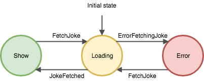

# reason react - tutorial

:construction: **Note:** Reason react, tool chain and testing tools are in an early stage an most of them are still experimental, so we should expect main changes and possibly this tutorial will become updated.

## Getting Started
#### Installing
`npm install`
#### Building
`npm bundle`
#### Running the tests
`npm test`
#### Run app locally
`npm serve`
# Tutorial
The idea of this project is to create a simple react app with reason but not using a prebuild-template, instead what we want is to build a project from scratch, so we will be aware of all the steps that should be done in terms of building, coding, dependencies, design patterns and running.

1. [Setup project](#setup-building)
    1. [Init project and tools](#init-reason-project-and-tool-chain)
    2. [Setup reason-react](#setup-reason-react)
    3. [Adding react code](#adding-react-code)
    4. [Web bundling](#web-bundling)
2. [Coding time](#coding-time)
    1. [Add testing dependencies](#add-testing-dependencies)
    2. [First iteration : show a remote random joke](#show-a-remote-random-joke)
        1. [Writing our first test](#writing-our-first-test)
        2. [Showing loader](#showing-loader)


# Setup project

## Init project and tools

```bash
mkdir your_awesome_app_name
cd your_awesome_app_name
npm init
```

To install BuckleScript (compiler that turns Reason code into JavaScript code) & Reason locally:

```bash
npm install --save-dev bs-platform
```
Generate a simple project template

```bash
./node_modules/bs-platform/lib/bsb -init . -theme basic-reason
```

This command should have generated a simple project scaffold with a simple file `src/Demo.re`:

```ocaml
Js.log("Hello, BuckleScript and Reason!");
```

Since we are have generated already a project we should update scripts in `package.json` in order to compile and run reason code:

```json
"scripts": {
    "test": "echo \"Error: no test specified\" && exit 1",
    "build": "bsb -make-world",
    "start": "bsb -make-world -w",
    "clean": "bsb -clean-world"
  },
```

Since we now have a .js file, we can run it with node.js:
```bash
npm run build
node src/Demo.bs.js
Hello, BuckleScript and Reason!
```

## Setup reason-react

Now we have to add react, in theory if we create a project from scratch with `bsb` and `-theme react` it would generate all the templating, but since we want to understand what we are doing let's do it manually.

First, install react:
```bash
npm install react react-dom reason-react
```

We should also change buckle script `bsconfig.json` to enable react builds adding a couple of lines, [more info](https://bucklescript.github.io/docs/en/build-configuration):

```json
"reason": {"react-jsx": 2},
"bs-dependencies": ["reason-react"],
```

## Adding react code

Now we should be able to add and compile some reason react code.

We will create a simple stateless react component in reason `HelloWorldReact.re`:

```ocaml
let component = ReasonReact.statelessComponent("HelloWorldReact");

let make = (_) => {
  ...component, /* spread the template's other defaults into here  */
  render: _self => <div> HelloWorld </div>
};

```
We should render it into the dom `Index.re`:
```ocaml
ReactDOMRe.renderToElementWithId(<HelloWorldReact />, "index");
```

And create a simple html to visualize it `index.html`:
```html
<!DOCTYPE html>
<html lang="en">
<head>
  <meta charset="UTF-8">
  <title>Reason React - Hello world</title>
</head>
<body>
  <div id="index"></div>
  <script src="./Index.bs.js"></script>
</body>
</html>
```
Now compile and run!

```bash
npm run build
open src/index.html
```
And ... errors in the browser `Uncaught ReferenceError: require is not defined at Index.bs.js:4`

Sadly, we won't see anything because now we are just exposing a bs file but what we really need to make it work in the browser is add all the dependencies. We can do this in two different ways:

- Adding all the required scripts to the html (old way)
- Bundling all the dependecencies in one single js file (modern way)

## Web bundling

Bundling is the process to combines multiple files into a single file, besides that, optimization processes will be applied as well.

We will need a web bundler to automate all this process, so we will choose [Parcel](https://parceljs.org/), because why not?

```bash
npm install parcel-bundler --save-dev
```
Add bundle script to our `package.json`:

```json
{
  ...
  "scripts": {
   ...
   "serve": "parcel ./src/index.html",
   "bundle": "parcel build ./src/index.html"
  }
}
```

We can now bundle and serve our application in dev mode:

```bash
npm run serve
```

Or prepare the bundle for production:

```bash
npm run bundle
```

# Coding time: Random Joke App

Let's create an small real app that consumes a public api, our idea is simple, show a random joke:

- We will use a real service to get a joke : https://icanhazdadjoke.com/api
- First iteration: We will show a random joke.
- Second iteration: We will refresh the random joke with a button.

## Add testing dependencies

As a testing tools we want to use `jest` `react-test-renderer` and `enzyme`, but we should use the buckle-script bindings:

```bash
npm install --save-dev npm @glennsl/bs-jest bs-react-test-renderer bs-enzyme enzyme-adapter-react-16
```

Then add all the dependencies in your `bsconfig.json` as well:

```json
{
  ...
"bs-dependencies": ["reason-react", "@glennsl/bs-jest", "bs-enzyme", "bs-react-test-renderer"],
}
```

Add an script runner in `package.json`:

```json
{
  ...
  "scripts": {
   ...
   "test": "npm run build && jest",
   ...
  }
}
```

Create a simple test `__tests__/expect_test.re`, just to see if it worked:

```ocaml
open Jest

let () =

describe "Expect" (fun () -> 
  let open Expect in

  test "toBe" (fun () ->
    expect (1 + 2) |> toBe 3);
  )
);
```

## First iteration :  show a remote random joke

### Writing our first test
Now, we can do some TDD and write our first test `__tests__/RandomJoke_test.re`:

```ocaml

open Jest;

describe("<RandomJoke />", () => {
  open ExpectJs;

  test("render", () => {
    let component = ReactShallowRenderer.renderWithRenderer(<RandomJoke />);
    expect(Js.Undefined.return(component)) |> toBeDefined;
  });
});
```

We should create the component `src/RandomJoke.re`:

```ocaml
let component = ReasonReact.statelessComponent("RandomJoke");

let make = (_) => {
  ...component,
  render: _self => <div> {ReasonReact.string("todo")} </div>
};
```

Some notes:
- In OCaml/Reason all functions should be wrap into a modules `module MyModule = {...}`, but by default files are map to a module, so we don't need code it.
- In ReasonReact, instead of passing the whole "class" ReasonReact.createElement function, you'd instead declare a make function, it will be desugared to something like `ReasonReact.element(RandomJoke.make(...))`

And run the test:

```bash
npm test
 PASS  __tests__/RandomJoke_test.bs.js
  <RandomJoke />
    ✓ render (5ms)

Test Suites: 1 passed, 1 total
Tests:       1 passed, 1 total
Snapshots:   0 total
Time:        0.97s, estimated 1s
Ran all test suites.
```
Great! Now we are ready to add some production code!

### Design the component

Before start adding more tests, we could do some TDD inside-out, so we will think about the big picture and the possible solution instead using tests to drive us through the design process.

If we think in our component, we could think about it as an state machine that stores the status of the component and can change it depending on the action it receives.

<p align="center">
  
</p>

States:
- Loading
- Show
- Error

Actions:
- FetchJoke
- JokeFetched
- ErrorFetchingJoke

Translated to some code:

```ocaml
type joke = string;

type error = string;

type state =
  | Loading
  | Show(joke)
  | Error(error);

type action =
  | FetchJoke
  | JokeFetched(joke)
  | ErrorFetchingJoke(error);
```
ReasonML let us create [sum types](https://en.wikipedia.org/wiki/Algebraic_data_type) with pipe operator; they call them [variants](https://reasonml.github.io/docs/en/variant).

### Initial state: Loading

Since we want to show a remote joke, our first statec should will be `Loading` and what we want to see is loading message/screen while we are fetching the data. To make it more interesting we will pass our loading message to the component `__tests__/RandomJoke_test.re`.

First, as following TDD approach `red`, `green`, `refactor`, we should write some test an make it `RED`:

```ocaml
 open ReactTestRenderer;
 ...
  test("snapshot while loading", () => {
    let json = toJSON(create(<RandomJoke />));
    expect(json)  |> toMatchSnapshot;
  });

  test("snapshot while loading changing the default message", () => {
    let component = toJSON(create(<RandomJoke loadingMessage="Wait for the joke ..."/>));
    expect(component) |> toMatchSnapshot;
  });
```

Note: Since ReasonML doesn't have the notion of null or undefined, we should wrap our component with `Js.Undefined.return`. [More info](https://reasonml.github.io/docs/en/null-undefined-option)

Second, think about how to make our tests pass and make them `GREEN`: 
```ocaml
let component = ReasonReact.statelessComponent("RandomJoke");

let make = (~loadingMessage="loading ...", _children) => {
  ...component,
  render: _self => <div> (ReasonReact.string(loadingMessage)) </div>
};
```
And finally, `REFACTOR` improving the existing implementation, in my personal opinion, a code that you could commit.

```ocaml
type joke = string;

type error = string;

type state =
  | Loading
  | Show(joke)
  | Error(error);

type action =
  | FetchJoke
  | JokeFetched(joke)
  | ErrorFetchingJoke(error);

let component = ReasonReact.reducerComponent("RandomJoke");

let make = (~loadingMessage="loading ...", _children) => {
  ...component,
  initialState: () => Loading,
  reducer: (action, _state) => switch action {
    | FetchJoke => ReasonReact.NoUpdate
    | JokeFetched(_joke) => ReasonReact.NoUpdate
    | ErrorFetchingJoke(_error) => ReasonReact.NoUpdate
    },
  render: self => switch self.state {
    | Loading => <div> (ReasonReact.string(loadingMessage)) </div>
    | Show(_joke) => <div> (ReasonReact.string("TODO")) </div>
    | Error(_error) => <div> (ReasonReact.string("TODO")) </div>
  }
};
```
Some comments:
- `ReasonReact.reducerComponent` define a [stateful component](https://reasonml.github.io/reason-react/docs/en/state-actions-reducer) and it comes with "reducer" (like Redux) built in. So for small apps we can use it, for big apps there are some libraries like [reductive](https://github.com/reasonml-community/reductive).
- If you are not familiar with the term reducers, they specify how the application's state changes in response to actions sent. Remember that actions only describe what happened, but don't describe how the application's state changes.
- `(~loadingMessage="loading ...", _children)`: Props are just the labeled arguments that we specify with `~` and `_children` just should be specified always as last argument, adding `_` in order to skip warnings in compile time. 
- `switch` statement, reason as a cousin of OCaml (funtional language), provide us with a powerful mechanism called _pattern matching_, and we will use it as much as possible because **It is NOT a switch-case**
- We have added all the states and actions to the code in order to skip all the compilation warnings that reason gives us about the pattern-matching exhaustiveness.

### Fetching state

The next step is interact with the external API, what would be need to do that?

- An http client [bs-fetch](https://github.com/reasonml-community/bs-fetch)
- A json encode/decoder [bs-json](https://github.com/glennsl/bs-json)

Follow the instructions to install.

decode and test

# Improvements

todo extract to a statless component for a more complicated! 
Presentational and Container Components
pass functions down or write a render-prop/hoc fetching and generalize the component


